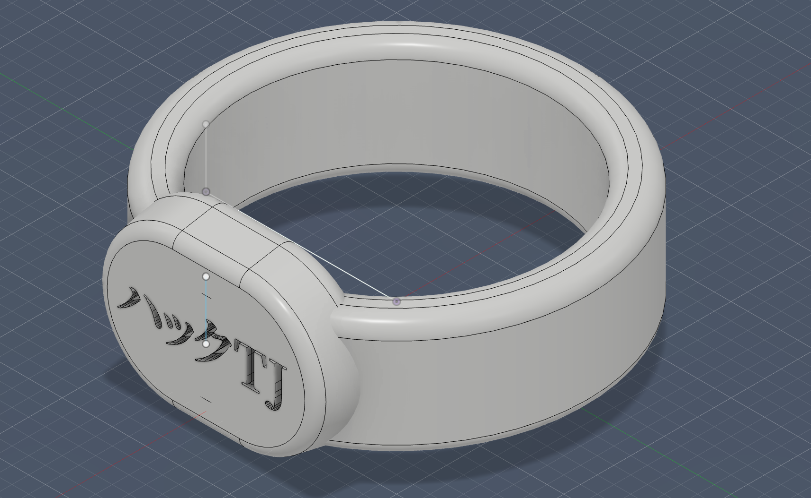
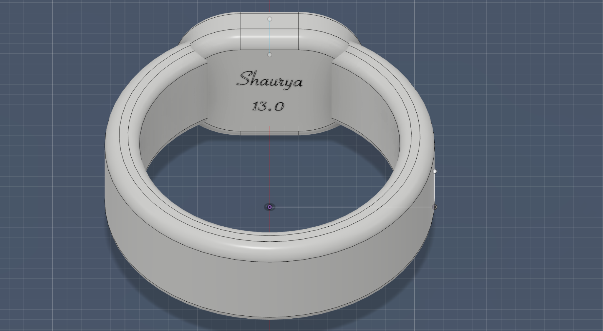

# Rings

## Short Description
This is is a custom 3D-modeled signet ring project designed in Fusion 360 and intended to be printed in white PLA. The ring uses a rounded signet face, engraved HackTJ branding on the front, and optional personalized engraving on the inside.

## Pictures

### Full 3D Model

### Inside Engraving / Inner Detail

